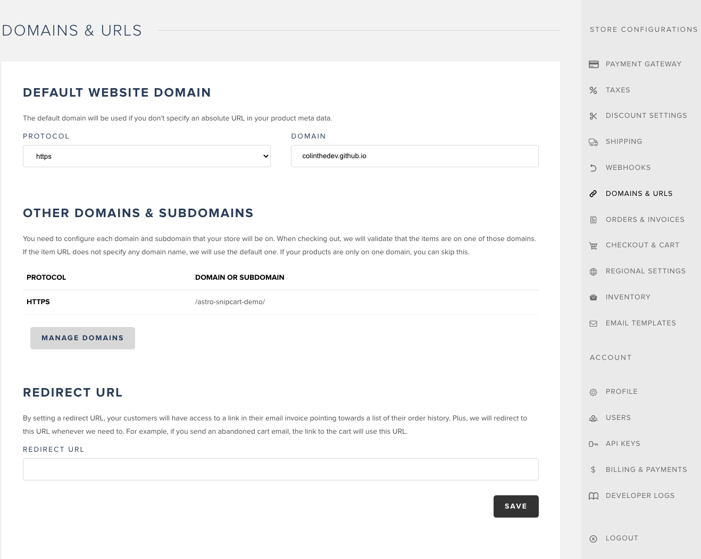
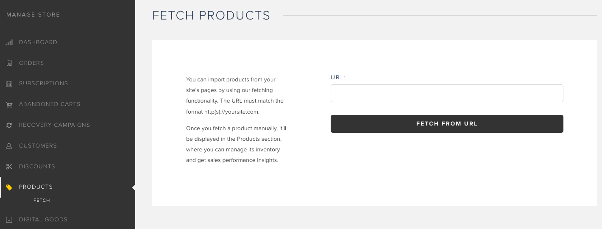
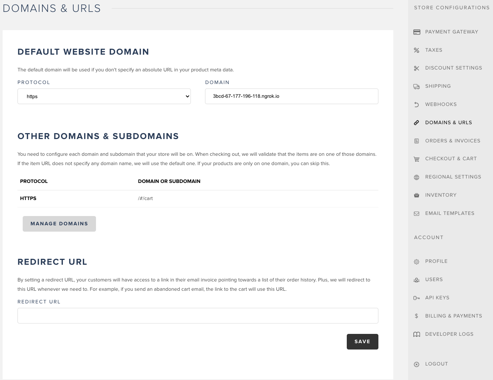

# Hosting an Astro + Snipcart site on github pages

#### The reason for hosting this on GH pages is to be able to test/interact with Snipcarts product backend and import products from the frontend by using its fetching functionality.

#### *Also note: Snipcarts API key used for this is the "test" key - When switching to "live" mode you would not want to expose your key on the frontend for security reasons, instead import your "live" key in from an env varible.
-  publicApiKey: import.meta.env.PUBLIC_SNIPCART_API_KEY,
-  [Resource On This](https://docs.snipcart.com/v3/testing/environment)

Resources:
- [Get Started](https://app.snipcart.com/dashboard)
- [Create a GH Pages](https://docs.github.com/en/pages/getting-started-with-github-pages/creating-a-github-pages-site)
- [Deploy Guide](https://docs.astro.build/en/guides/deploy/)
- [When You're Ready To Go Live](https://docs.snipcart.com/v3/testing/going-live)

In order to compile i also had to create a .ts file and include this bit of code in the tsconfig.json file:

    {
      "compilerOptions": {
        // Enable top-level await, and other modern ESM features.
        "target": "ESNext",
        "module": "ESNext",
        // Enable node-style module resolution, for things like npm package imports.
        "moduleResolution": "node",
        // Enable JSON imports.
        "resolveJsonModule": true,
        // Enable stricter transpilation for better output.
        "isolatedModules": true,
        // Add type definitions for our Vite runtime.
        "types": ["vite/client"]
      },
      "compileOnSave": false,
      "exclude": [
        "src",
        "wwwroot"
      ],
      "include": [
        "required.ts"
      ]
    }

More specifically the part that was added was the arrays after the first object.

### Notes
- When making the GH pages the GH pages branch has to be set to 'gh-pages' not main
- In snipcart backend there are two things you need to do besides getting your API key:
  - You need to set your domain and sub-domain
  
  - You need to fetch products from gh pages url
  

##### ** UPDATE: Ive found it difficult to get snipcart to interact with GH pages to be able to test checkout functionality 

# Using ngrok to test checkout functionality

Resources:
-  [Installing ngrok](https://ngrok.com/download)
-  [Configuring Snipcart With ngrok](https://snipcart.com/blog/develop-a-snipcart-powered-website-locally-using-ngrok)

Some reasons using ngrok is the better option:
-  I was able to get this working and interacting in only about a half hour
-  Install process is simple
-  Simple to 'expose' any local server you just need ngrok installed on your computer

### Heres the steps i followed to get this working:

Installing ngrok:
-  [Install ngrok](https://ngrok.com/download)
-  Add your authtoken
-  Start a 'tunnel'
     -  The 'tunnel' port you enter should be the same port your localhost is running on
-  Navigate to the 'Web Interface' url to see requests and online/offline status

Configuring Astro to work with ngrok:
-  You're going to need to change the product url to match the 'forwarding' url given by ngrok 

Configuring Snipcart to work with everything:
-  Set the domain to match the 'forwarding' url given by ngrok
-  Set the subdomain of /#/checkout

